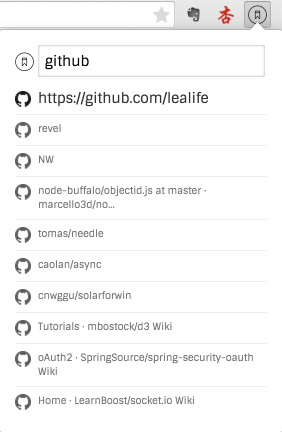
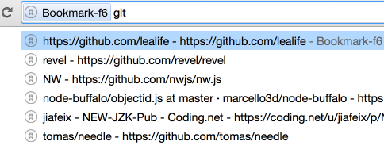
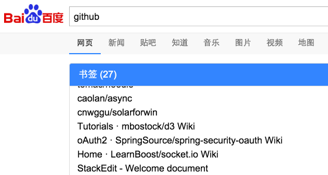
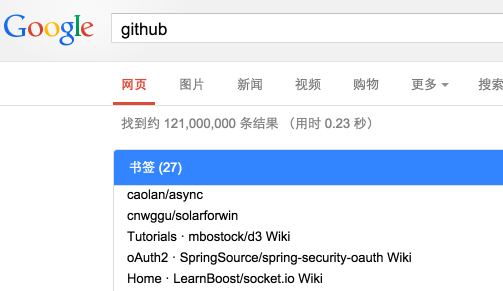

# 书签
By F6. 产品孵化

## 基本功能
* 百度首页上搜索, 同步搜索标签并显示 
	* 基本功能, 支持百度, Google [ok]
    * 键盘控制 [TODO] @litie
	* 美化 [TODO] @chubo
	* 折叠 [TODO] @xiaqing
	* 隐藏 [TODO] @xiaqing
    * 网页logo [TODO] @xiaqing
* popup搜索 [ok]
* 搜索栏搜索 [ok]

## 高级功能
* 云同步
* 云搜索

## Chrome插件开发教程
* 入门 http://www.cnblogs.com/walkingp/archive/2011/03/31/2001628.html
* 进阶 http://blog.csdn.net/my_business/article/details/7711525
* Chrome plugin API 文档 http://open.chrome.360.cn/extension_dev/overview.html

## Preview

